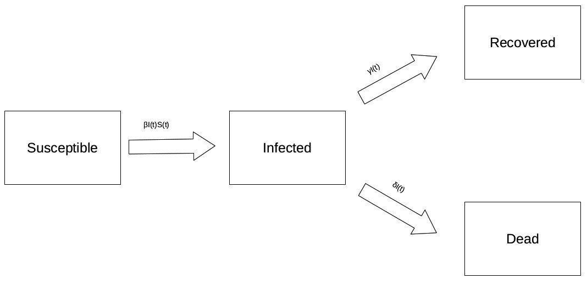

# COVID19
An attempt to model the COVID19 data from the [Johns Hopkins Github Repository](https://github.com/CSSEGISandData) by a SIRD model for various countries such as Germany, Switzerland and the US. This Github repository contains a shiny app that estimates the model parameters and then simulates how to disease would progress based on these estimates.

## SIRD model

## SIRD model equations
\begin{equation}
\frac{dS}{dt} = -\beta I(t) S(t) \\
\frac{dI}{dt} = \beta I(t) S(t) - \gamma I - \delta I \\
\frac{dR}{dt} = \gamma I \\
\frac{dD}{dt} = \delta I \\
R_0 = N \frac{\beta}{\gamma + \delta}
\end{equation}
where N is the size of the population which is assumed to be constant.

## Model estimation
To estimate the model parameters a RMSE estimator was used that compares the simulated number and the true number for infected, recovered and dead cases.