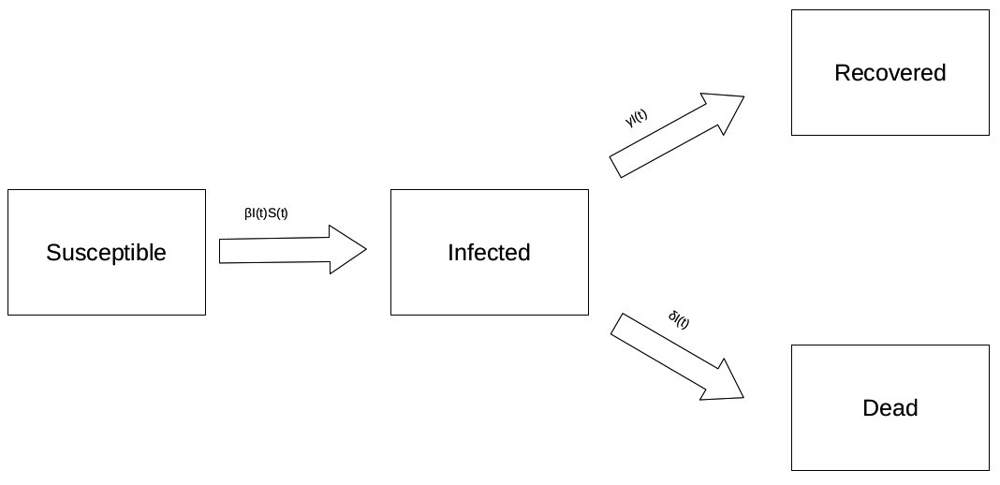

```{r setup, include=FALSE}
knitr::opts_chunk$set(echo = FALSE, message = FALSE, warning = FALSE, fig.align = "center")
```

## Agenda
- What does SIR(D) stand for?
- Explanation of all model components
- Assumptions of the SIR(D) model
- What is the basic reproductive number?
- How to estimate a SIR(D) model?

## Assumptions of the SIR(D) model
- constant population
- rate of infectectives is proportional to the contact between susceptibles and infected
- constant reproductive number and constant recovery/death rate

## How to estimate a SIRD model

```{r}

```

The differential equations making up this system of ODE are listed on the following slide:

## How to estimate a SIRD model
$$\frac{dS}{dt} = -\beta I(t) S(t)$$
$$\frac{dI}{dt} = \beta I(t) S(t) - \gamma I - \delta I$$
$$\frac{dR}{dt} = \gamma I$$
$$\frac{dD}{dt} = \delta I$$
$$R_0 = N \frac{\beta}{\gamma + \delta}$$
where N is the size of the population which is assumed to be constant.

## Shiny app demonstration

```{r, echo = FALSE}
shiny::shinyAppDir(
  getwd(),
  options = list(width = "100%"))
```
